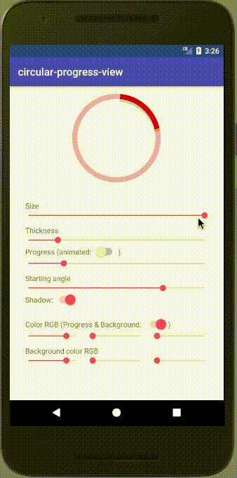

# CircularProgressView:


[](https://travis-ci.org/GuilhE/android-circular-progress-view) 
[](https://www.codacy.com/app/GuilhE/android-circular-progress-view?utm_source=github.com&utm_medium=referral&utm_content=GuilhE/android-circular-progress-view&utm_campaign=badger)  [](https://android-arsenal.com/details/1/6152) [](https://appetize.io/app/7367zekaq62q5upw2c3y17wme4)

A fancy CircularProgressView.

#### Version 1.x
  - **Apr, 2019**       - Added rounded progress
  - **Jun, 2018**       - Added reverse progress
  - **May, 2018**       - Added _"multiple-arc-progress"_
  - **February, 2018**  - Background alpha enable/disable
  - **November, 2017**  - Progress thumb and animation callback
  - **September, 2017** - CircularProgressView


## Getting started

Include it into your project, for example, as a Gradle dependency:

```groovy
implementation 'com.github.guilhe:circular-progress-view:${LATEST_VERSION}'
```
[](https://search.maven.org/search?q=a:circular-progress-view)  [](https://bintray.com/gdelgado/android/circular-progress-view/_latestVersion)  

## Sample usage

Check out the __sample__ module where you can find a few examples of how to create it by `xml` or `java`.

Attributes accepted in xml:
```xml
<declare-styleable name="CircularProgressView">
    <attr name="max" format="integer"/>
    <attr name="shadow" format="boolean"/>
    <attr name="progressThumb" format="boolean"/>
    <attr name="startingAngle" format="integer"/>
    <attr name="progress" format="integer"/>
    <attr name="progressBarThickness" format="dimension"/>
    <attr name="progressBarColor" format="color"/>
    <attr name="progressBarRounded" format="boolean"/>
    <attr name="backgroundColor" format="color"/>
    <attr name="backgroundAlphaEnabled" format="boolean"/>
    <attr name="reverse" format="boolean"/>
</declare-styleable>
```
Example:
```xml
<com.github.guilhe.views.CircularProgressView
                    android:layout_width="100dp"
                    android:layout_height="100dp"
                    app:progress="60"
                    app:progressBarThickness="10dp"
                    app:progressBarColor="@android:color/holo_purple"/>
 ```

There are many methods to help you customize this `View` by code. For more details checkout the __sample app__, _javadocs_ or the code itself.

## Sample


_Animation last update on April, 2019_

<a href='https://play.google.com/store/apps/details?id=com.github.guilhe.cicularprogressview.sample&pcampaignid=MKT-Other-global-all-co-prtnr-py-PartBadge-Mar2515-1'></a>

## Binaries

Binaries and dependency information for Gradle, Maven, Ivy and others can be found at [https://search.maven.org](https://search.maven.org/#search%7Cga%7C1%7Ca%3A%22circular-progress-view%22).

<a href='https://bintray.com/gdelgado/android/circular-progress-view?source=watch' alt='Get automatic notifications about new "circular-progress-view" versions'></a>

## Dependencies
- [com.android.support:support-annotations](https://developer.android.com/topic/libraries/support-library/packages.html#annotations)

## Bugs and Feedback

For bugs, questions and discussions please use the [Github Issues](https://github.com/GuilhE/android-circular-progress-view/issues).

 
## LICENSE

Copyright (c) 2017-present, CircularProgressView Contributors.

Licensed under the Apache License, Version 2.0 (the "License");
you may not use this file except in compliance with the License.
You may obtain a copy of the License at

<http://www.apache.org/licenses/LICENSE-2.0>

Unless required by applicable law or agreed to in writing, software
distributed under the License is distributed on an "AS IS" BASIS,
WITHOUT WARRANTIES OR CONDITIONS OF ANY KIND, either express or implied.
See the License for the specific language governing permissions and
limitations under the License.
