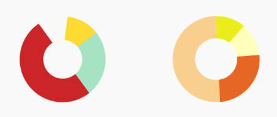

# CircularProgressView


[](https://android-arsenal.com/details/1/6152) [](https://appetize.io/app/jeftbchvbfuafwpeaf00fba8bm)


A fancy CircularProgressView.

## Installation

CircularProgressView is distributed through [Maven Central](https://search.maven.org/artifact/com.github.guilhe/circular-progress-view), [Jcenter](https://bintray.com/gdelgado/android/circular-progress-view) and [Jitpack](https://jitpack.io/#GuilhE/circular-progress-view).

```groovy
implementation 'com.github.guilhe:circular-progress-view:${LATEST_VERSION}'
```
[](https://search.maven.org/search?q=g:com.github.guilhe%20AND%20circular-progress-view) [](https://bintray.com/gdelgado/android/circular-progress-view/_latestVersion) 

## Usage
Check out the __sample__ module where you can find a few examples of how to create it by `xml` or `java`.

Attributes accepted in xml:
```xml
    <attr name="max" format="integer" />
    <attr name="shadow" format="boolean" />
    <attr name="progressThumb" format="boolean" />
    <attr name="progressThumbSize" format="dimension" />
    <attr name="progressThumbSizeRate" format="float" />
    <attr name="progressThumbSizeMaxRate" format="float" />
    <attr name="startingAngle" format="integer" />
    <attr name="progress" format="integer" />
    <attr name="progressBarThickness" format="dimension" />
    <attr name="progressBarColor" format="color" />
    <attr name="progressBarColorArray" format="reference" />
    <attr name="progressBarColorArrayPositions" format="reference" />
    <attr name="duplicateFirstColorInArray" format="boolean" />
    <attr name="progressBarRounded" format="boolean" />
    <attr name="progressBackgroundColor" format="color" />
    <attr name="progressBackgroundAlphaEnabled" format="boolean" />
    <attr name="reverse" format="boolean" />
    <attr format="enum" name="progressThumbScaleType">
        <enum name="auto" value="0"/>
        <enum name="point" value="1"/>
        <enum name="rate" value="2"/>
    </attr>
```
Example:
```xml
<com.github.guilhe.views.CircularProgressView
    android:layout_width="100dp"
    android:layout_height="100dp"
    app:progress="60"
    app:progressBarThickness="10dp"
    app:progressBarColor="@android:color/holo_purple"/>
 ```

### @BindingAdapters
You can take advantage of [Binding Adapters (from Data Binding)](https://developer.android.com/topic/libraries/data-binding/binding-adapters#kotlin) to create some helper attributes, example:  
```java
@BindingAdapter("progressAnimated")
fun setProgressAnimated(view: CircularProgressView, progress: Int) {
    view.setProgress(progress, true);
}
```  
```xml
<com.github.guilhe.views.CircularProgressView
    ...
    app:progressAnimated="@{viewModel.progress}"/>
``` 

### Progress with gradient
For the given array of colors:
```xml
<array name="rainbow">
    <item>#FFF60000</item>
    <item>#FFFF8C00</item>
    <item>#FFFFEE00</item>
    <item>#FF4DE94C</item>
    <item>#FF3783FF</item>
    <item>#FF4815AA</item>
</array>
```
The default result will be (left):  


To achieve the result on the right side you have two options: either copy the first color and add it as last, or use the helper attribute/method that does that for you:
```xml
<attr name="duplicateFirstColorInArray" format="boolean"/>
```  
```java
setProgressColors(@NonNull @ColorInt int[] colors, @Nullable float[] positions, boolean duplicateFirst)
```  
Finally, you may also use the attribute `progressBarColorArrayPositions` to pass a `float[] positions`:
```xml
<array name="rainbow_positions">
    <item type="dimen" format="float">.44</item>
    ...
 </array>
```
 __note:__ when using the helper function __and__ `positions[]`, you'll have to add an extra position for the last one being copied.

There are many methods to help you customize this `View` by code. For more details checkout the __sample app__, _javadocs_ or the code itself.

### "Multiple Progress" for PieChart


```java
setProgress(@NonNull List<Float> progressList, @NonNull List<Integer> progressColorList)
```
This mode can be used to display a simple pie chart. It will disable the progress thumb, the background color and the progress will not be round.  

## Sample


_Animation last update on April, 2019_

<a href='https://play.google.com/store/apps/details?id=com.github.guilhe.cicularprogressview.sample&pcampaignid=MKT-Other-global-all-co-prtnr-py-PartBadge-Mar2515-1'></a>

## Dependencies
- [com.android.support:support-annotations](https://developer.android.com/topic/libraries/support-library/packages.html#annotations)

## Bugs and Feedback
For bugs, questions and discussions please use the [Github Issues](https://github.com/GuilhE/android-circular-progress-view/issues).

## LICENSE
Copyright (c) 2017-present, GuilhE.

Licensed under the Apache License, Version 2.0 (the "License");
you may not use this file except in compliance with the License.
You may obtain a copy of the License at

<http://www.apache.org/licenses/LICENSE-2.0>

Unless required by applicable law or agreed to in writing, software
distributed under the License is distributed on an "AS IS" BASIS,
WITHOUT WARRANTIES OR CONDITIONS OF ANY KIND, either express or implied.
See the License for the specific language governing permissions and
limitations under the License.
